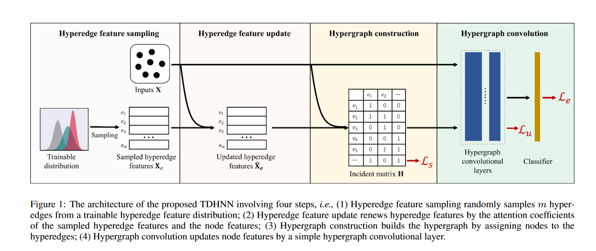

[](https://github.com/HHW-zhou/TSMMG)
[](https://www.researchsquare.com/article/rs-3845824/v1)


# TDHNN
**Totally Dynamic Hypergraph Neural Network**  
Authored by Peng Zhou, Zongqian Wu, Xiangxiang Zeng, Guoqiu Wen, Junbo Ma, and Xiaofeng Zhu.

This work has been accepted by IJCAI 2023.


## Datasets
We used the same datasets as those used in [HGNN](https://github.com/iMoonLab/HGNN/tree/master).
+ [ModelNet40_mvcnn_gvcnn_feature](https://drive.google.com/file/d/1euw3bygLzRQm_dYj1FoRduXvsRRUG2Gr/view)
+ [NTU2012_mvcnn_gvcnn_feature](https://drive.google.com/file/d/1Vx4K15bW3__JPRV0KUoDWtQX8sB-vbO5/view)

# Cite
```
@inproceedings{zhou2023totally,
  title={Totally dynamic hypergraph neural network},
  author={Zhou, Peng and Wu, Zongqian and Zeng, Xiangxiang and Wen, Guoqiu and Ma, Junbo and Zhu, Xiaofeng},
  booktitle={Proceedings of the Thirty-Second International Joint Conference on Artificial Intelligence},
  pages={2476--2483},
  year={2023}
}
```


